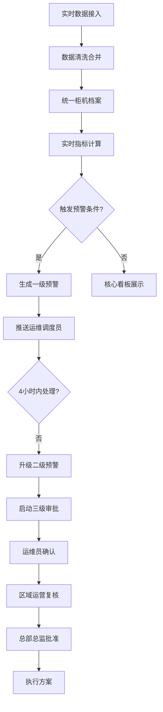

## 1. 产品概述

全国性智能快递柜运营与用户取件行为分析平台，面向快递柜运营商提供实时监控、智能预警、数据分析和决策支持的一体化解决方案。

- 核心目标：通过实时数据接入与智能分析，提升柜机运营效率，降低运维成本，优化资源配置
- 目标用户：总部运营人员、区域运营经理、网点运维调度员、设备总监
- 核心价值：数据驱动的精细化运营，自动化预警与处置流程，智能预测与资源调配

## 2. 核心功能

### 2.1 用户角色

| 角色 | 注册方式 | 核心权限 |
|------|----------|----------|
| 总部管理员 | 系统创建 | 全国数据查看、全局报表、审批管理、系统配置 |
| 区域运营 | 系统创建 | 所辖区域数据查看、区域报表、复核审批、预警处理 |
| 网点运维 | 系统创建 | 所辖网点柜机监控、预警确认、故障上报、补货调度 |
| 设备总监 | 系统创建 | 最终审批、设备调拨、策略制定 |

### 2.2 功能模块

1. **核心看板**：全国柜机分布热力图、区域使用率排名、故障率统计、关键指标卡片
2. **柜机详情**：单柜机7天使用率曲线、用户取件时段分布、历史故障记录、补货记录
3. **预警中心**：一级/二级预警列表、预警处理流程、预警历史统计
4. **审批中心**：三级审批流程（运维确认→区域复核→总监批准）、审批记录
5. **智能预测**：小区活动Excel上传、72小时取件高峰预测、增柜/调拨方案推荐
6. **运营报告**：每周自动生成诊断报告、同比环比分析、优化策略推荐
7. **权限管理**：三级权限控制、用户管理、角色配置
8. **数据接入**：实时数据接入模拟、柜机档案管理

### 2.3 页面详情

| 页面名称 | 模块名称 | 功能描述 |
|----------|----------|----------|
| 登录页 | 身份认证 | 账号密码登录、角色选择、记住登录 |
| 核心看板 | 概览模块 | 关键指标卡片（总柜机数、在线率、使用率、周转率） |
| 核心看板 | 热力图模块 | 全国/城市柜机分布热力图、支持缩放、点击下钻 |
| 核心看板 | 排名模块 | 区域使用率排名、故障率排名、运营商排名 |
| 核心看板 | 实时预警 | 最新预警滚动展示、快速处理入口 |
| 柜机详情 | 基础信息 | 柜机档案、位置、型号、安装时间 |
| 柜机详情 | 使用率曲线 | 近7天24小时使用率趋势图、时段对比 |
| 柜机详情 | 取件分布 | 用户取件时段分布柱状图、工作日/周末对比 |
| 柜机详情 | 历史记录 | 故障记录、补货记录、运维操作日志 |
| 预警中心 | 预警列表 | 分级预警列表、筛选搜索、批量处理 |
| 预警中心 | 预警详情 | 预警原因、历史处理记录、关联柜机信息 |
| 审批中心 | 待我审批 | 待审批列表、审批操作（同意/驳回）、审批意见 |
| 审批中心 | 已审批 | 历史审批记录、审批流程追踪 |
| 智能预测 | 活动上传 | Excel模板下载、活动预报上传、人流增量提取 |
| 智能预测 | 预测结果 | 72小时取件量预测曲线、高峰时段标注 |
| 智能预测 | 推荐方案 | 增柜方案、柜机调拨方案、成本收益分析 |
| 运营报告 | 报告列表 | 每周报告列表、报告预览、下载导出 |
| 运营报告 | 报告详情 | 使用率同比环比、故障类型分布、补货效率排名、优化建议 |
| 系统管理 | 用户管理 | 用户列表、新增/编辑用户、角色分配 |
| 系统管理 | 角色权限 | 角色配置、权限项配置、数据范围配置 |

## 3. 核心流程

### 3.1 预警与审批流程

1. 系统实时监控柜机数据，连续3小时使用率低于10%或故障超过2小时未修复 → 生成一级预警
2. 一级预警推送至运维调度员，4小时内未处理 → 升级为二级预警
3. 二级预警触发三级审批流程：
   - 运维员确认问题并提出解决方案（调整补货频次/更换柜体）
   - 区域运营经理复核方案可行性
   - 总部设备总监最终批准
4. 审批通过后自动生成执行任务，同步至运维调度系统

### 3.2 智能预测流程

1. 运营人员上传小区活动预报Excel（包含活动时间、预估人流等）
2. 系统自动提取人流增量数据，结合历史取件数据
3. 使用预测模型计算未来72小时各时段取件量
4. 识别高峰时段与缺口，自动推荐增柜或柜机调拨方案
5. 运营人员确认方案后，生成调拨任务单

## 4. 用户界面设计

### 4.1 设计风格

- **主色调**：深蓝色系（#1e3a8a / #2563eb），体现专业、可靠、科技感
- **辅助色**：橙色（#f97316）用于预警强调，绿色（#10b981）用于正常状态，红色（#ef4444）用于严重故障
- **中性色**：深灰（#1f2937）用于文字，中灰（#6b7280）用于辅助信息，浅灰（#f3f4f6）用于背景
- **按钮风格**：圆角6px，主按钮深蓝色填充带微妙hover阴影，次按钮边框式
- **字体**：Inter 作为界面字体，清晰现代；数字展示使用等宽字体增强可读性
- **布局风格**：卡片式布局，信息分组清晰，充足留白，数据可视化区域突出
- **图标风格**：Lucide 线性图标，统一24px尺寸，与文字对齐

### 4.2 页面设计概述

| 页面名称 | 模块名称 | UI元素 |
|----------|----------|--------|
| 核心看板 | 概览卡片 | 渐变背景卡片，大字号指标，趋势箭头，微动画 |
| 核心看板 | 热力图 | 深色地图背景，热度点按使用率着色，hover显示详情 |
| 核心看板 | 排名列表 | 排名序号高亮，进度条展示，前三名特殊样式 |
| 柜机详情 | 曲线图 | 平滑曲线，填充渐变，多图例切换，交互tooltip |
| 柜机详情 | 时段分布 | 分组柱状图，工作日/周末双色对比 |
| 预警中心 | 预警列表 | 按级别色条标识，状态标签，倒计时显示 |
| 审批中心 | 审批流程 | 步骤条展示，已完成/当前/待处理状态区分 |
| 智能预测 | 预测曲线 | 历史数据与预测数据分区展示，置信区间阴影 |

### 4.3 响应式

- Desktop-first 设计，主内容区最小宽度1280px
- 侧边栏可折叠，适配不同屏幕尺寸
- 数据可视化图表支持自适应容器宽度
- 表格区域支持水平滚动查看完整数据

### 4.4 动效设计

- 页面加载：卡片淡入上移动画，错落延迟
- 数据更新：数字滚动动画，指标卡微妙闪烁
- 预警推送：右上角滑入通知，轻微震动效果
- 图表交互：hover时数据点放大，tooltip平滑出现
- 导航切换：内容区淡入淡出过渡
