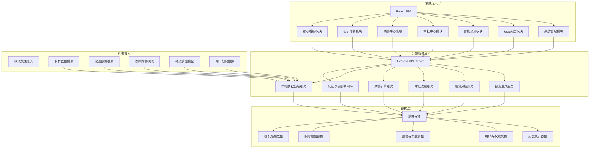
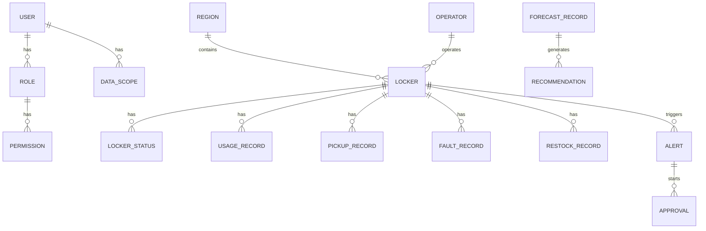

## 1. 架构设计



## 2. 技术描述

- **前端**: React@18 + TypeScript + Vite + TailwindCSS@3 + Zustand + React Router
- **图表可视化**: Recharts（数据图表）+ 自定义SVG热力图
- **后端**: Express@4 + TypeScript
- **数据处理**: 前端Mock数据 + 后端内存数据存储
- **UI组件**: Lucide React（图标）
- **样式方案**: TailwindCSS + CSS Variables
- **状态管理**: Zustand 进行全局状态管理

## 3. 路由定义

| 路由路径 | 页面名称 | 权限要求 |
|----------|----------|----------|
| /login | 登录页 | 公开 |
| /dashboard | 核心看板 | 登录用户 |
| /locker/:id | 柜机详情 | 登录用户（数据范围权限） |
| /alerts | 预警中心 | 登录用户 |
| /approvals | 审批中心 | 登录用户（对应审批角色） |
| /forecast | 智能预测 | 区域及以上 |
| /reports | 运营报告 | 区域及以上 |
| /admin/users | 用户管理 | 总部管理员 |
| /admin/roles | 角色权限 | 总部管理员 |

## 4. API 定义

### 4.1 认证相关

```typescript
// 登录
POST /api/auth/login
Request: { username: string; password: string }
Response: { token: string; user: User; permissions: string[] }

// 获取当前用户信息
GET /api/auth/me
Response: { user: User; permissions: string[]; dataScope: DataScope }
```

### 4.2 柜机相关

```typescript
// 获取柜机列表（带分页和筛选）
GET /api/lockers?page=1&pageSize=20&region=&model=
Response: { list: Locker[]; total: number }

// 获取单个柜机详情
GET /api/lockers/:id
Response: LockerDetail

// 获取柜机使用率数据（近7天，按小时）
GET /api/lockers/:id/usage?days=7
Response: { date: string; hour: number; usageRate: number }[]

// 获取用户取件时段分布
GET /api/lockers/:id/pickup-distribution
Response: { hour: number; weekday: number; weekend: number }[]

// 获取区域柜机统计
GET /api/lockers/stats/by-region
Response: { region: string; count: number; avgUsage: number; faultRate: number }[]
```

### 4.3 预警相关

```typescript
// 获取预警列表
GET /api/alerts?level=&status=&page=1
Response: { list: Alert[]; total: number }

// 处理预警
POST /api/alerts/:id/handle
Request: { action: string; remark: string }
Response: { success: boolean }

// 获取预警统计
GET /api/alerts/stats
Response: { level1: number; level2: number; handled: number; pending: number }
```

### 4.4 审批相关

```typescript
// 获取待审批列表
GET /api/approvals/pending
Response: Approval[]

// 获取已审批列表
GET /api/approvals/history
Response: Approval[]

// 审批操作
POST /api/approvals/:id/approve
Request: { opinion: string; approve: boolean }
Response: { success: boolean }
```

### 4.5 预测相关

```typescript
// 上传活动预报Excel
POST /api/forecast/upload
Request: FormData(file)
Response: { events: Event[]; extracted: boolean }

// 获取72小时预测结果
GET /api/forecast/72h?regionId=
Response: { time: string; predicted: number; confidence: number }[]

// 获取推荐方案
GET /api/forecast/recommendations
Response: Recommendation[]
```

### 4.6 报表相关

```typescript
// 获取报告列表
GET /api/reports?page=1
Response: { list: Report[]; total: number }

// 获取报告详情
GET /api/reports/:id
Response: ReportDetail

// 生成周报
POST /api/reports/generate-weekly
Response: { reportId: string }
```

## 5. 数据模型

### 5.1 数据模型定义



### 5.2 核心类型定义

```typescript
// 用户与权限
interface User {
  id: string;
  username: string;
  name: string;
  role: 'hq' | 'region' | 'branch' | 'director';
  regionId?: string;
  branchId?: string;
  permissions: string[];
}

interface DataScope {
  level: 'national' | 'region' | 'branch';
  regionIds?: string[];
  branchIds?: string[];
}

// 柜机
interface Locker {
  id: string;
  code: string;
  name: string;
  model: string;
  capacity: number;
  region: string;
  regionId: string;
  city: string;
  address: string;
  operator: string;
  installDate: string;
  status: 'online' | 'offline' | 'fault';
  lat: number;
  lng: number;
}

interface LockerDetail extends Locker {
  todayUsage: number;
  todayTurnover: number;
  avgPickupTime: number;
  avgFaultRecovery: number;
  currentUsage: number;
}

// 使用记录
interface UsageRecord {
  id: string;
  lockerId: string;
  date: string;
  hour: number;
  usageRate: number;
  pickupCount: number;
  deliveryCount: number;
}

// 预警
interface Alert {
  id: string;
  lockerId: string;
  lockerName: string;
  level: 1 | 2;
  type: 'low_usage' | 'fault_timeout';
  message: string;
  createdAt: string;
  status: 'pending' | 'processing' | 'resolved' | 'escalated';
  handledAt?: string;
  handledBy?: string;
}

// 审批
interface Approval {
  id: string;
  alertId: string;
  type: 'restock_adjust' | 'replace_locker';
  currentStep: 1 | 2 | 3;
  status: 'pending' | 'approved' | 'rejected';
  steps: ApprovalStep[];
  createdAt: string;
}

interface ApprovalStep {
  step: 1 | 2 | 3;
  role: string;
  approver?: string;
  opinion?: string;
  approved?: boolean;
  approvedAt?: string;
}

// 预测
interface ForecastPoint {
  time: string;
  predicted: number;
  lower: number;
  upper: number;
}

interface Recommendation {
  id: string;
  type: 'add_locker' | 'transfer';
  region: string;
  description: string;
  cost: number;
  estimatedBenefit: number;
  priority: 'high' | 'medium' | 'low';
}

// 报表
interface WeeklyReport {
  id: string;
  week: string;
  startDate: string;
  endDate: string;
  avgUsage: number;
  avgUsageWoW: number;
  avgUsageYoY: number;
  faultTypes: { type: string; count: number }[];
  restockEfficiency: { region: string; avgTime: number }[];
  recommendations: string[];
}
```
